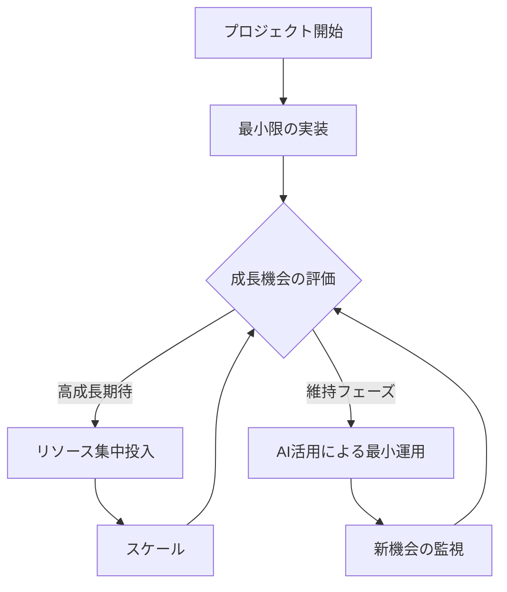

# NPO開発アプローチガイド

## 🎯 開発理念：アダプティブ・プロジェクト・マネジメント

私たちのNPOは、社会のニーズと技術の可能性を最大限に活かすため、独自の開発アプローチを採用しています。
このアプローチは、限られたリソースを効果的に活用しながら、複数のプロジェクトを並行して進める手法です。

### 主要な特徴

#### 1. 動的リソース配分
- **集中と分散の最適化**：成長が見込まれるプロジェクトに重点的にリソースを配分
- **スマートなスケーリング**：各プロジェクトの規模を状況に応じて柔軟に調整
- **機会損失の最小化**：プロジェクトを完全に停止せず、最小限の形で維持

#### 2. 持続可能な運営モデル
- **AIを活用した効率化**：
  - 運用コストの最小化
  - 自動化による継続的な活動維持
  - データ駆動の意思決定
- **機動的なリソース再配分**：
  - 社会情勢の変化への迅速な対応
  - 新しい機会の活用
  - チーム能力の最大化

#### 3. オープンな開発プロセス
- **GitHub Projectsの活用**
  - 全プロジェクトの可視化
  - タスク進捗の透明性確保
  - チーム間のコラボレーション促進

### 💡 開発サイクル

### 🌟 メリット

1. **リソースの効率的活用**
   - 人的リソースの最適配分
   - 運営コストの最小化
   - 機会損失の防止

2. **透明性の確保**
   - オープンな開発プロセス
   - 進捗の可視化
   - ステークホルダーとの信頼関係構築

3. **継続的な成長**
   - 複数分野での知見蓄積
   - 機会に応じた迅速なスケーリング
   - 持続可能な運営モデル

### 📈 期待される成果

- 社会課題への継続的な取り組み
- 効率的なリソース活用による持続可能な運営
- コミュニティとの強い信頼関係構築
- イノベーションの促進と社会的インパクトの最大化

## 🔄 実装プロセス

1. **プロジェクト立ち上げ**
   - ニーズ分析
   - 実現可能性評価
   - 初期チーム編成

2. **アジャイル開発サイクル**
   - 短期スプリントによる迅速な開発
   - 定期的なレビューと方向性の調整
   - ステークホルダーからのフィードバック収集

3. **継続的な評価と最適化**
   - データに基づく成果測定
   - リソース配分の定期的な見直し
   - 運用プロセスの改善

---

このアプローチにより、私たちは限られたリソースを最大限に活用しながら、
社会的インパクトの創出と持続可能な運営の両立を目指しています。
