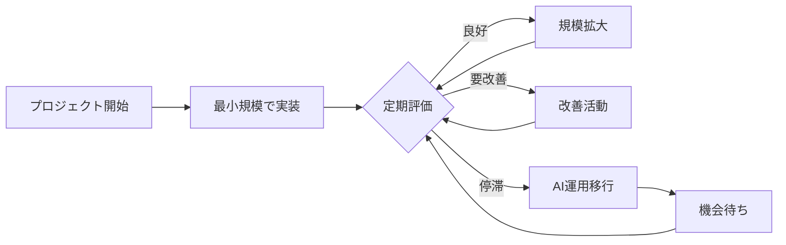
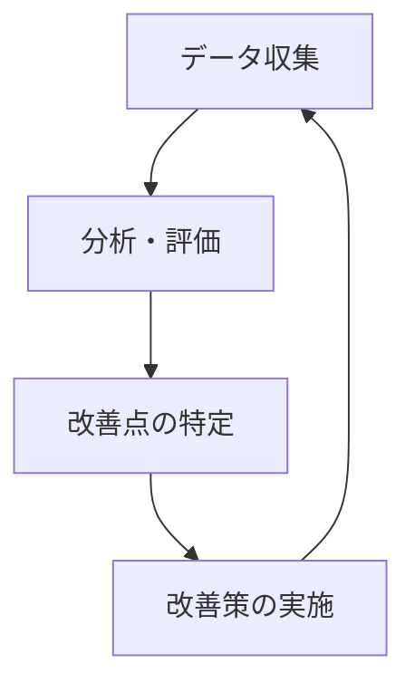

# NPOの未来志向な開発アプローチ📚

このリポジトリは、限られたリソースで最大の社会的インパクトを生み出すための、NPO運営・開発モデルをまとめたものです。「小さな種から大きな森を育てる」というコンセプトに基づき、AIを活用した効率的な運営と柔軟なプロジェクト管理の方法論を提供します。

## 目次 📋
- [はじめに](#はじめに)
- [私たちの特徴的な開発スタイル](#私たちの特徴的な開発スタイル)
- [プロジェクトの実例](#プロジェクトの実例)
- [なぜこのアプローチが効果的か](#なぜこのアプローチが効果的か)
- [発展的な運営モデル](#発展的な運営モデル)
- [詳細ドキュメント一覧](#詳細ドキュメント一覧)
- [実施ロードマップ](#実施ロードマップ)
- [貢献について](#貢献について)
- [おわりに](#おわりに)

## はじめに 🌱

私たちのNPOは、「小さな種から大きな森を育てる」という考え方で活動しています。
限られたリソースを賢く活用しながら、様々な社会課題に取り組んでいます。

## 私たちの特徴的な開発スタイル 🎯

### 1. マルチプロジェクトの柔軟な運営

私たちは、複数のプロジェクトを同時に進めています。これは、まるで庭師が複数の植物を育てるように：

- 🌳 **成長期のプロジェクト**
  - 大きく育ちそうな芽には集中的に水やり（リソース投入）
  - チーム体制を強化
  - 積極的な機能開発

- 🌱 **種まき期のプロジェクト**
  - 小さく始めて可能性を探る
  - 最小限のリソースで運営
  - 基礎となる実績を積み重ね

- 🌿 **待機中のプロジェクト**
  - AIを活用して最小限運用
  - 社会のニーズや機会を待つ
  - 必要最小限の活動を継続

### 2. スマートな運営方法 💡

#### プロジェクト評価の仕組み

私たちは、信号機のような分かりやすい3段階で各プロジェクトを評価します：

🟢 **緑信号** - 順調に進行中
- 目標達成率90%以上
- チームの士気が高い
- 社会的インパクトが明確

🟡 **黄信号** - 要注意・改善フェーズ
- 目標達成率70-89%
- 何らかの課題が発生
- 改善の余地あり

🔴 **赤信号** - 見直しが必要
- 目標達成率70%未満
- 深刻な課題が発生
- AI運用への移行を検討

#### 実際の運用サイクル



### 3. オープンな開発環境 👥

#### GitHub Projectsの活用

すべてのプロジェクトはGitHubで公開されています：

- 📊 **進捗の可視化**
  - タスクボードで現在の状況が一目で分かる
  - 誰でも閲覧可能
  - 活動の透明性を確保

- 👥 **チームワークの促進**
  - タスクの割り当てが明確
  - チーム間の連携がスムーズ
  - 情報共有が容易

## プロジェクトの実例 📘

### ケース1：成長プロジェクト
```
開始時：小規模なコミュニティ支援ツール
↓
ニーズの高まりを確認
↓
チーム増強、機能拡張
↓
現在：地域で広く使われるサービスに成長
```

### ケース2：待機プロジェクト
```
開始時：環境モニタリングシステム
↓
一定の成果を確認
↓
社会的ニーズの変化
↓
現在：AIによる自動運用で最小限の活動を継続
```

## なぜこのアプローチが効果的か 🎯

1. **リソースの効率的な活用**
   - 必要なところに必要な分だけリソースを投入
   - 無駄な投資を避ける
   - 機会損失を最小限に

2. **継続的な可能性の探索**
   - 複数の分野で知見を蓄積
   - 社会の変化に柔軟に対応
   - 新しい機会を逃さない

3. **持続可能な運営**
   - AIの活用で運営コストを削減
   - チームの負担を適切にコントロール
   - 長期的な活動を可能に

## 発展的な運営モデル 🚀

当NPOの運営モデルは以下の主要要素で構成されています：

### 適応型リソース配分 📊

プロジェクトの状態とポテンシャルに応じて、リソースを動的に配分します：

- **選択と集中**：成長中のプロジェクトにリソースを集中
- **最小存続戦略**：成長前・待機中のプロジェクトは最小リソースで維持
- **定期的な再評価**：3ヶ月ごとのポートフォリオ評価とリソース再配分

> 詳細は[リソース管理ガイド](docs/resource-management-guide.md)をご参照ください（現在作成中）

### コミュニティ参加モデル 👨‍👩‍👧‍👦

オープンソースの精神を取り入れ、外部からの参加を促進します：

- **外部貢献の仕組み**
  - 明確なコントリビューションガイドライン
  - 初心者向けの「Good First Issue」の設定
  - 定期的な公開ミーティング

- **コミュニティ認知と報酬**
  - 積極的な貢献者の表彰
  - 参加者同士の交流の場

> 詳細は[コミュニティエンゲージメント手引き](docs/community-engagement-guide.md)をご参照ください（現在作成中）

### インパクト測定と評価 📈

データに基づく意思決定とインパクト向上のための評価システム：

- **測定の仕組み**
  - プロジェクト別の具体的な成果指標
  - 受益者へのインタビューや事例収集
  - リアルタイムインパクトダッシュボード



> 詳細は[インパクト評価フレームワーク](docs/impact-assessment-framework.md)をご参照ください（現在作成中）

### AI活用の具体的方法論 🤖

各プロジェクトステージに応じたAI活用のガイドライン：

- **プロジェクト規模別AI活用**
  - 🌱 **種まき期**：市場調査、アイデア生成、初期プロトタイプ
  - 🌿 **待機中**：自動返信、データ収集・分析、最小限運用自動化
  - 🌳 **成長期**：意思決定支援、高度な分析、パーソナライゼーション

> 詳細は[AI活用ガイドライン](docs/ai-implementation-guide.md)をご参照ください（現在作成中）

## 詳細ドキュメント一覧 📑

各領域の詳細については、以下の専門ドキュメントをご参照ください（順次作成・公開予定）：

0. [NPO開発ガイド（詳細版）](docs/npo-development-guide.md)
   - このREADMEの詳細版
   - 運営モデルの包括的な説明
   - 実施方法の詳細
1. [リソース管理ガイド](docs/resource-management-guide.md)
2. [GitHub活用ガイド](docs/github-usage-guide.md)
3. [AI活用ガイドライン](docs/ai-implementation-guide.md)
4. [コミュニティエンゲージメント手引き](docs/community-engagement-guide.md)
5. [インパクト評価フレームワーク](docs/impact-assessment-framework.md)
6. [知識管理システム](docs/knowledge-management-system.md)
7. [資金調達戦略](docs/fundraising-strategy.md)
8. [パートナーシップフレームワーク](docs/partnership-framework.md)

## 実施ロードマップ 🗺️

このモデルの導入は段階的に進めることをお勧めします：

### フェーズ1：基本インフラの整備（1-2ヶ月目）
- GitHub Projectsの設定
- 初期プロジェクト評価の実施
- 基本的なドキュメント体系の確立

### フェーズ2：評価システムの構築（3-4ヶ月目）
- インパクト測定指標の確立
- 初期データ収集の開始
- パイロットプロジェクトでのAI活用試験

### フェーズ3：コミュニティ拡大（5-6ヶ月目）
- 外部貢献者向けガイドラインの公開
- 初回オープンミーティングの開催
- フィードバックシステムの整備

### フェーズ4：完全実装（7-12ヶ月目）
- 全プロジェクトへの運営モデル適用
- 包括的なインパクトレポートの作成
- モデルの評価と改善

## 貢献について 🤝

このフレームワークやドキュメントの改善にご協力いただける方を歓迎します！

- **貢献方法**:
  1. このリポジトリをフォーク
  2. 変更用のブランチを作成 (`git checkout -b feature/amazing-improvement`)
  3. 変更をコミット (`git commit -m 'Add some amazing improvement'`)
  4. ブランチにプッシュ (`git push origin feature/amazing-improvement`)
  5. プルリクエストを作成

- **コントリビューション例**:
  - ドキュメントの改善や翻訳
  - 事例の追加
  - 新しいAIツールやテクニックの提案

## おわりに 🌈

このアプローチにより、私たちは限られたリソースで最大限の社会的インパクトを目指しています。
まるで種を撒き、水をやり、成長を見守る庭師のように、
各プロジェクトの可能性を大切に育てながら、持続可能な形で社会に貢献していきます。

透明性を確保し、コミュニティの参加を促進することで、支援者からの信頼を獲得し、
持続可能なNPO運営を実現します。AIの活用と戦略的なパートナーシップにより、
小規模チームでも大きな社会的インパクトを生み出すことが可能になります。

小さく始めて大きく育てる。それが私たちのNPO運営の哲学であり、このガイドはその実践のための道しるべです。
