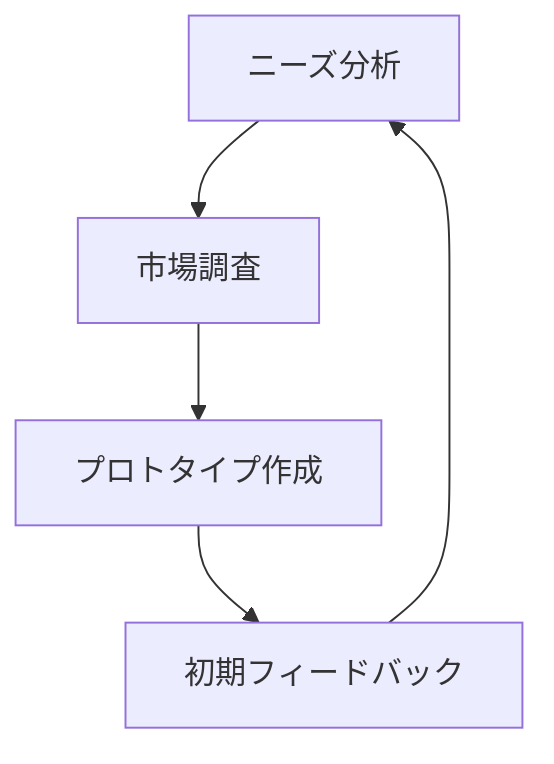
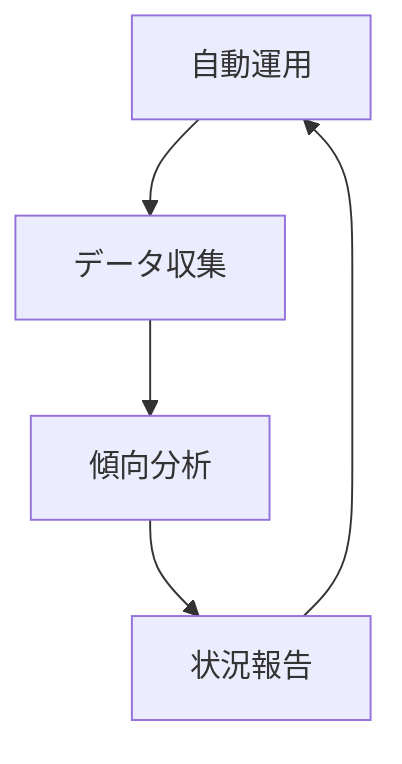
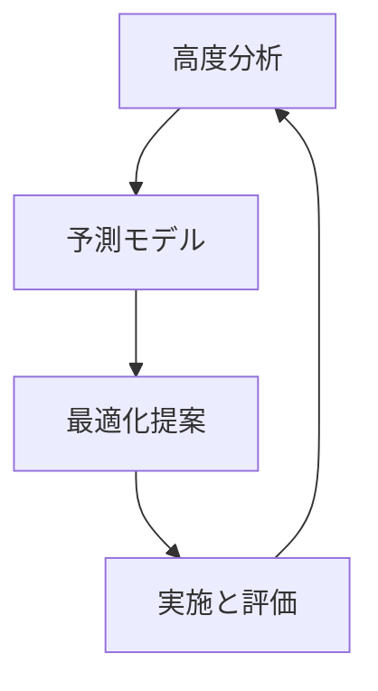
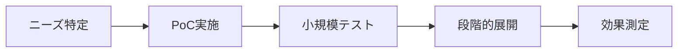
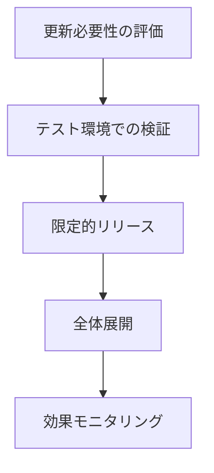
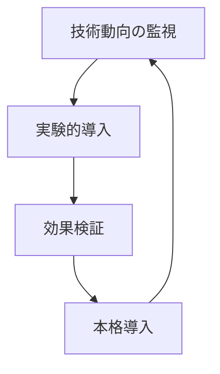

# AI活用ガイドライン 🤖

このガイドラインでは、NPOの運営と開発におけるAIの効果的な活用方法について説明します。

## 目次
- [導入の目的](#導入の目的)
- [プロジェクトステージ別活用方法](#プロジェクトステージ別活用方法)
- [具体的な活用例](#具体的な活用例)
- [倫理的配慮](#倫理的配慮)
- [実装ガイドライン](#実装ガイドライン)
- [メンテナンス体制](#メンテナンス体制)
- [今後の展望](#今後の展望)

## 導入の目的

AIを導入する主な目的は以下の通りです：

1. **運営効率の向上**
   - 定型業務の自動化
   - データ分析の効率化
   - 意思決定支援

2. **リソースの最適化**
   - 人的リソースの効果的配置
   - コスト削減
   - 作業時間の短縮

3. **サービス品質の向上**
   - パーソナライズされた支援
   - 24時間対応の実現
   - データに基づく改善

## プロジェクトステージ別活用方法

### 🌱 種まき期プロジェクト



- **活用ポイント**
  - 市場調査の自動化
  - アイデア生成支援
  - 簡易プロトタイプ作成

### 🌿 待機中プロジェクト



- **活用ポイント**
  - 自動応答システム
  - データ自動収集
  - 最小限の運用自動化

### 🌳 成長期プロジェクト



- **活用ポイント**
  - 詳細なデータ分析
  - パーソナライゼーション
  - 予測モデルの活用

## 具体的な活用例

### 1. コミュニケーション効率化

```typescript
interface AutoResponseSystem {
  analyzeQuery(input: string): Promise<string>;
  generateResponse(context: Context): Promise<string>;
  learnFromInteraction(interaction: Interaction): void;
}

class NPOChatbot implements AutoResponseSystem {
  // 実装例
}
```

### 2. データ分析・可視化

```python
class ImpactAnalyzer:
    def analyze_metrics(self, data):
        """
        社会的インパクトの分析
        """
        pass

    def generate_report(self):
        """
        レポート自動生成
        """
        pass
```

### 3. 業務自動化

```javascript
class TaskAutomation {
  constructor() {
    this.tasks = new Map();
  }

  scheduleTask(taskName, frequency) {
    // タスクのスケジューリング
  }

  executeTask(taskName) {
    // タスクの実行
  }
}
```

## 倫理的配慮

### プライバシー保護

- データの匿名化
- 適切なデータ保持期間
- 利用目的の明確化

### 透明性の確保

- AIの使用範囲の明示
- 判断プロセスの説明可能性
- 人間の監督体制

### 公平性の担保

- バイアスの検出と軽減
- 多様性への配慮
- 定期的な評価と改善

## 実装ガイドライン

### 1. 導入ステップ



### 2. 品質管理

- **モニタリング指標**
  - 応答精度
  - 処理速度
  - ユーザー満足度
  - エラー率

- **改善サイクル**
  ```mermaid
  graph TD
      A[データ収集] --> B[分析]
      B --> C[改善点特定]
      C --> D[実装]
      D --> A
  ```

### 3. セキュリティ対策

```typescript
interface SecurityMeasures {
  encryptData(data: any): Promise<string>;
  validateAccess(user: User): boolean;
  logActivity(action: string): void;
}
```

### 4. スケーリング戦略

- **段階的な展開**
  1. 小規模テスト
  2. フィードバック収集
  3. 改善実施
  4. 展開範囲拡大

- **リソース管理**
  ```javascript
  class ResourceManager {
    monitorUsage() {
      // リソース使用状況の監視
    }

    optimizeAllocation() {
      // リソースの最適配分
    }
  }
  ```

## メンテナンス体制

### 1. 定期チェック項目

- モデルの精度評価
- パフォーマンス測定
- ユーザーフィードバック分析
- セキュリティチェック

### 2. 更新プロセス



### 3. トラブルシューティング

- エラーログの監視
- インシデント対応フロー
- バックアップ体制
- 復旧手順

## 今後の展望

### 1. 技術トレンド

- 自然言語処理の進化
- 画像認識技術の向上
- 自動化技術の発展
- エッジコンピューティングの普及

### 2. 将来の活用分野

- **予測分析の高度化**
  - 社会課題の早期発見
  - リソース需要の予測
  - インパクト予測

- **自動化の拡大**
  - 業務プロセスの完全自動化
  - 意思決定支援の高度化
  - マルチモーダルAIの活用

### 3. 継続的な改善



## 付録

### AI活用チェックリスト

- [ ] 目的の明確化
- [ ] 倫理的考慮事項の確認
- [ ] リソース評価
- [ ] 実装計画の策定
- [ ] テスト環境の準備
- [ ] 評価指標の設定
- [ ] モニタリング体制の確立
- [ ] フィードバックループの構築
