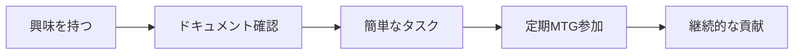
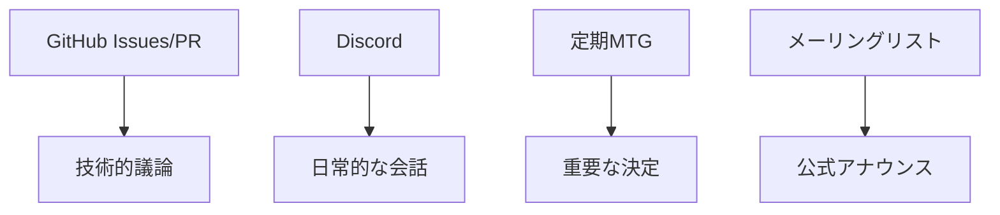
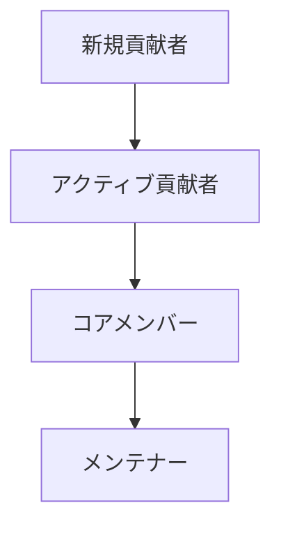
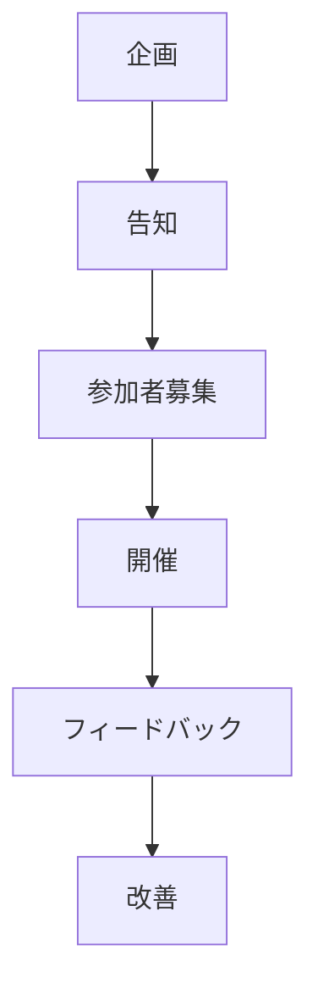

# コミュニティエンゲージメント手引き 👥

このガイドは、NPOのオープンなコミュニティ運営とコミュニティメンバーの参加促進について説明します。

## 目次
- [コミュニティの価値](#コミュニティの価値)
- [参加の方法](#参加の方法)
- [コミュニケーションガイドライン](#コミュニケーションガイドライン)
- [貢献のフロー](#貢献のフロー)
- [報奨制度](#報奨制度)
- [イベント運営](#イベント運営)

## コミュニティの価値

私たちのコミュニティは以下の価値観を大切にしています：

### 1. オープン性 🌐

- **透明性の確保**
  - すべての議論をパブリックに
  - 意思決定プロセスの可視化
  - 進捗状況の共有

- **包括性**
  - 多様な背景の受け入れ
  - バリアフリーな参加環境
  - 多言語対応

### 2. 互恵関係 🤝

- **Win-Winの関係構築**
  - 参加者の成長機会の提供
  - 技術的知見の共有
  - キャリア開発支援

### 3. 持続可能性 ♻️

- **長期的な視点**
  - 段階的な参加促進
  - 知識の蓄積と共有
  - コミュニティ文化の醸成

## 参加の方法

### 1. 初めての方向けステップ



1. **プロジェクト理解**
   - READMEの確認
   - コントリビューションガイドの確認
   - プロジェクトの目的理解

2. **環境構築**
   - リポジトリのクローン
   - 依存関係のインストール
   - 開発環境の準備

3. **first contribution**
   - Good First Issue の確認
   - 簡単なバグ修正
   - ドキュメント改善

### 2. 貢献の種類

- **コード貢献**
  - 機能開発
  - バグ修正
  - テスト作成

- **非コード貢献**
  - ドキュメント作成
  - デザイン提案
  - 翻訳支援
  - イベント運営

- **コミュニティ支援**
  - 新規参加者のメンタリング
  - 質問への回答
  - フィードバック提供

## コミュニケーションガイドライン

### 1. 基本原則

- **リスペクト**
  - 多様な意見の尊重
  - 建設的な議論
  - 批判ではなく提案を

- **明確さ**
  - 具体的な説明
  - 文脈の提供
  - 誤解を避ける配慮

### 2. コミュニケーションチャネル



### 3. 議論の進め方

```typescript
interface DiscussionProcess {
  presentIdea(): void;
  gatherFeedback(): Feedback[];
  refineProposal(): Proposal;
  reachConsensus(): Decision;
}

class ConstructiveDiscussion implements DiscussionProcess {
  // 実装
}
```

## 貢献のフロー

### 1. Issue作成

```markdown
## 概要
[変更・追加の簡潔な説明]

## 目的
[なぜこの変更が必要か]

## 提案内容
[具体的な実装案]

## タスク
- [ ] タスク1
- [ ] タスク2
- [ ] タスク3
```

### 2. プルリクエスト

```markdown
## 変更内容
[実装した内容の説明]

## 関連Issue
[関連するIssue番号]

## テスト
- [ ] ユニットテスト
- [ ] 統合テスト
- [ ] 動作確認

## スクリーンショット
[必要に応じて]
```

## 報奨制度

### 1. 貢献レベル



### 2. 認定基準

- **新規貢献者**
  - 1つ以上のPRがマージ
  - ドキュメントの改善

- **アクティブ貢献者**
  - 定期的な貢献
  - コミュニティ支援

- **コアメンバー**
  - 重要機能の開発
  - レビュー活動
  - メンタリング

- **メンテナー**
  - プロジェクト方針決定
  - 品質管理
  - コミュニティ運営

### 3. 特典

- バッジ制度
- 技術メンタリング
- イベント優先参加
- 認定証の発行

## イベント運営

### 1. 定期イベント

- **週次開発MTG**
  - 進捗共有
  - 技術的議論
  - 次週計画

- **月次全体会**
  - 成果報告
  - 方針共有
  - Q&Aセッション

### 2. 特別イベント

- **ハッカソン**
  - アイデア実装
  - チーム形成
  - 技術共有

- **勉強会**
  - 技術トピック
  - ベストプラクティス
  - ケーススタディ

### 3. イベント計画



## メトリクス

### 1. コミュニティ健全性指標

- アクティブ貢献者数
- Issue解決率
- PRレビュー時間
- コミュニティ満足度

### 2. 分析と改善

```python
class CommunityMetrics:
    def analyze_engagement(self):
        """
        コミュニティ参加度の分析
        """
        pass

    def identify_improvements(self):
        """
        改善ポイントの特定
        """
        pass
```

## 付録

### チェックリスト

#### 新規参加者向け
- [ ] READMEの確認
- [ ] 行動規範の確認
- [ ] 開発環境の構築
- [ ] Good First Issueの確認

#### イベント運営者向け
- [ ] 目的の設定
- [ ] 参加者の募集
- [ ] 資料の準備
- [ ] フィードバックの収集

#### メンテナー向け
- [ ] Issue/PRの確認
- [ ] レビューの実施
- [ ] ドキュメントの更新
- [ ] コミュニティ支援
