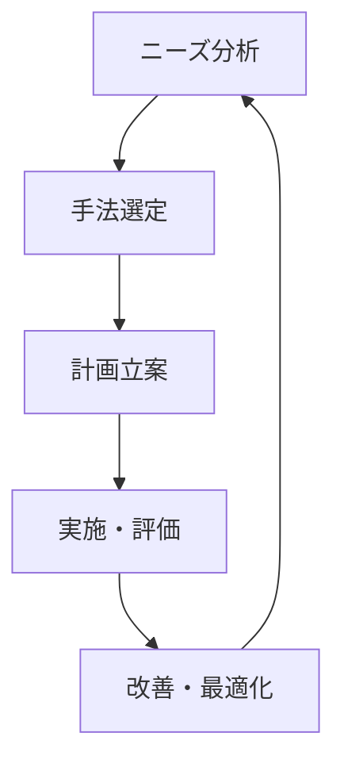
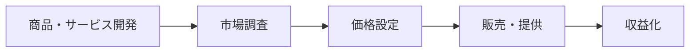
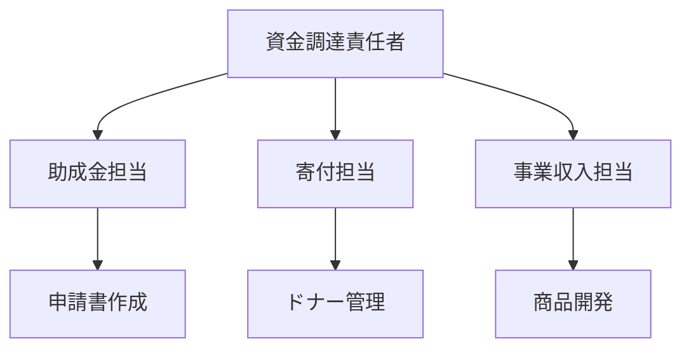
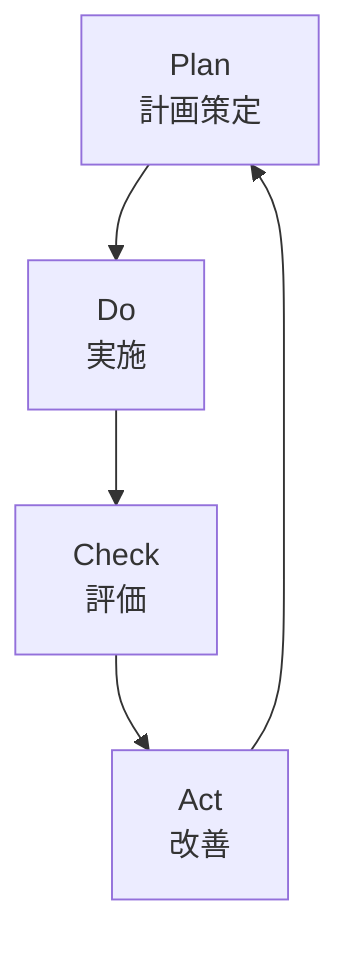

# 資金調達戦略 💰

このドキュメントでは、NPOの持続可能な運営を実現するための資金調達戦略について説明します。

## 目次
- [基本方針](#基本方針)
- [資金調達手法](#資金調達手法)
- [実施計画](#実施計画)
- [リスク管理](#リスク管理)
- [評価と改善](#評価と改善)
- [報告体制](#報告体制)

## 基本方針

### 1. 戦略的アプローチ



- **持続可能性**
  - 長期的な視点
  - 安定的な収入源
  - リスク分散

- **透明性**
  - 使途の明確化
  - 報告の徹底
  - 説明責任

### 2. 多様な資金源

```typescript
interface FundingSource {
  type: string;
  target: number;
  timeline: string;
  requirements: string[];
  risks: Risk[];
}
```

## 資金調達手法

### 1. 助成金・補助金

- **公的機関**
  - 国の助成制度
  - 地方自治体の支援
  - EU等の国際機関

- **民間財団**
  - 企業財団
  - 公益財団
  - 国際財団

### 2. 寄付プログラム

```javascript
class DonationProgram {
  constructor() {
    this.regularDonors = new Map();
    this.oneTimeDonors = new Set();
    this.campaigns = [];
  }

  launchCampaign(campaign) {
    // キャンペーン立ち上げ
  }

  processDonation(donation) {
    // 寄付処理
  }

  generateReport() {
    // レポート生成
  }
}
```

### 3. 事業収入



- **商品販売**
  - オリジナルグッズ
  - 環境配慮製品
  - デジタルコンテンツ

- **サービス提供**
  - コンサルティング
  - 研修・講座
  - イベント運営

### 4. クラウドファンディング

```python
class CrowdfundingCampaign:
    def plan_campaign(self):
        """キャンペーン企画"""
        pass
    
    def create_content(self):
        """コンテンツ作成"""
        pass
    
    def promote(self):
        """プロモーション実施"""
        pass
```

## 実施計画

### 1. 年間スケジュール

| 時期 | 主な活動 | 目標額 |
|-----|---------|--------|
|第1四半期|助成金申請|500万円|
|第2四半期|寄付キャンペーン|300万円|
|第3四半期|イベント収入|200万円|
|第4四半期|年末募金|400万円|

### 2. リソース配分

```typescript
interface ResourceAllocation {
  staffing: {
    fundraising: number;
    marketing: number;
    admin: number;
  };
  budget: {
    operations: number;
    marketing: number;
    tools: number;
  };
  timeline: {
    planning: Date;
    execution: Date;
    review: Date;
  };
}
```

### 3. 実施体制



## リスク管理

### 1. リスク評価

- **財務リスク**
  - 収入の不安定性
  - 為替変動
  - 資金繰り

- **レピュテーションリスク**
  - 信用低下
  - 風評被害
  - コンプライアンス

### 2. リスク対策

```javascript
class RiskManagement {
  assessRisk(risk) {
    // リスク評価
  }

  developCountermeasures(risk) {
    // 対策立案
  }

  implementControls() {
    // 統制実施
  }
}
```

## 評価と改善

### 1. 評価指標

```python
class FundraisingMetrics:
    def calculate_roi(self):
        """ROI計算"""
        pass
    
    def analyze_donor_retention(self):
        """ドナー維持率分析"""
        pass
    
    def measure_campaign_effectiveness(self):
        """キャンペーン効果測定"""
        pass
```

### 2. PDCAサイクル



## 報告体制

### 1. 定期報告

- **月次報告**
  - 収支状況
  - KPI進捗
  - 課題管理

- **年次報告**
  - 実績総括
  - 戦略評価
  - 次年度計画

### 2. ステークホルダー別報告

```typescript
interface StakeholderReport {
  donors: {
    impact: string;
    financials: object;
    future: string;
  };
  board: {
    strategy: string;
    risks: Risk[];
    metrics: Metric[];
  };
  public: {
    achievements: string;
    transparency: object;
    appreciation: string;
  };
}
```

## 付録

### チェックリスト

#### 計画立案
- [ ] 市場分析
- [ ] 目標設定
- [ ] 戦略策定
- [ ] スケジュール作成

#### 実施準備
- [ ] チーム編成
- [ ] ツール準備
- [ ] 広報材料作成
- [ ] 体制確認

#### モニタリング
- [ ] 進捗管理
- [ ] リスク監視
- [ ] 効果測定
- [ ] フィードバック収集
