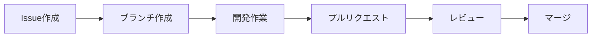
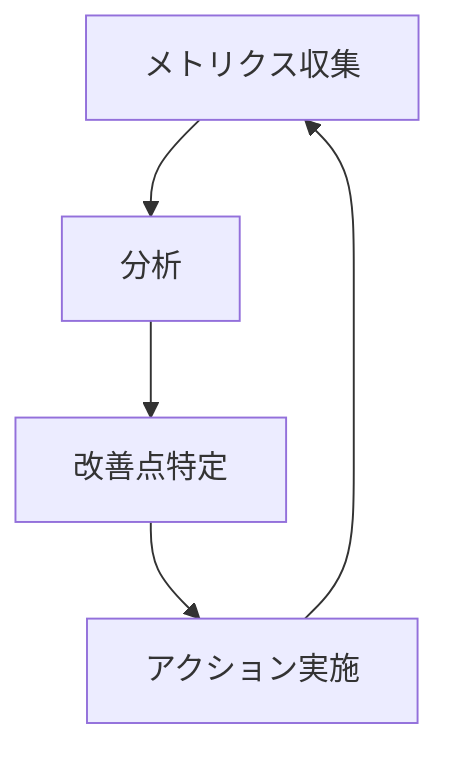

# GitHub活用ガイド 🚀

このガイドでは、当NPOでのGitHubの効果的な活用方法について説明します。

## 目次
- [基本的なワークフロー](#基本的なワークフロー)
- [ブランチ戦略](#ブランチ戦略)
- [Issue管理](#issue管理)
- [プルリクエスト](#プルリクエスト)
- [Projects活用](#projects活用)

## 基本的なワークフロー

私たちは以下のような基本的なワークフローを採用しています：



1. 新しい機能や修正はIssueとして記録
2. Issueに対応するブランチを作成
3. 開発作業を実施
4. プルリクエストを作成
5. コードレビュー実施
6. mainブランチへマージ

## ブランチ戦略

以下のブランチ命名規則を採用しています：

- `feature/xxx`: 新機能開発
- `fix/xxx`: バグ修正
- `docs/xxx`: ドキュメント更新
- `refactor/xxx`: リファクタリング
- `test/xxx`: テスト関連

例：
```bash
git checkout -b feature/add-new-evaluation-system
git checkout -b fix/resolve-login-issue
git checkout -b docs/update-readme
```

## Issue管理

### ラベル体系

- `priority/high`: 高優先度
- `priority/medium`: 中優先度
- `priority/low`: 低優先度
- `type/bug`: バグ
- `type/feature`: 新機能
- `type/documentation`: ドキュメント
- `good first issue`: 初心者向け
- `help wanted`: 協力募集中

### テンプレート

#### 機能要望
```markdown
## 概要
[機能の簡単な説明]

## 目的
[なぜこの機能が必要か]

## 提案内容
[具体的な実装案]

## 期待される効果
[実装後に期待される効果]
```

#### バグ報告
```markdown
## 発生している問題
[問題の簡単な説明]

## 再現手順
1. [手順1]
2. [手順2]
3. [手順3]

## 期待される動作
[本来どうあるべきか]

## 環境情報
- OS: [OS名]
- ブラウザ: [ブラウザ名]
- バージョン: [バージョン番号]
```

## プルリクエスト

### レビュープロセス

1. **自己レビュー**
   - コミットの整理
   - コードスタイルの確認
   - テストの実行

2. **レビュー依頼**
   - 適切なレビュワーの選定
   - 変更内容の説明
   - 影響範囲の明示

3. **レビュー実施**
   - コードの品質確認
   - 機能の動作確認
   - ドキュメントの更新確認

### マージ条件

- [ ] CIパスが緑
- [ ] 必要なレビューが完了
- [ ] コンフリクトが解消
- [ ] テストが追加/更新
- [ ] ドキュメントが更新

## Projects活用

### ボード構成


- **Backlog**: 未着手のタスク
- **Ready**: 着手可能な状態
- **In Progress**: 作業中
- **Review**: レビュー中
- **Done**: 完了

### タスク管理のベストプラクティス

1. **明確な期限設定**
   - 開始日と期限を明示
   - マイルストーンとの紐付け

2. **担当者の明確化**
   - 責任者のアサイン
   - レビュワーの指定

3. **進捗の可視化**
   - 定期的な状態更新
   - ブロッカーの早期共有

4. **コミュニケーションの促進**
   - タスクへのコメント活用
   - 週次進捗報告

## メトリクス活用

### トラッキング項目

- プルリクエストのマージまでの時間
- Issue解決までの時間
- コードレビューの完了率
- テストカバレッジ
- ドキュメント更新頻度



## セキュリティ設定

### 推奨設定

- 2要素認証の必須化
- ブランチ保護の設定
- シークレット情報の適切な管理
- 定期的なアクセス権レビュー

### 機密情報の取り扱い

- 環境変数の使用
- .gitignoreの適切な設定
- シークレットの暗号化
