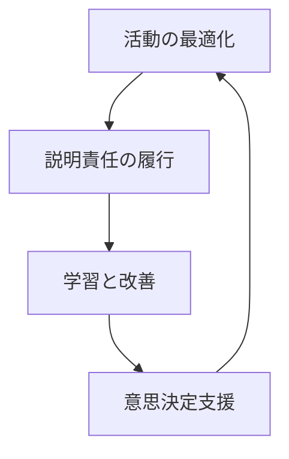
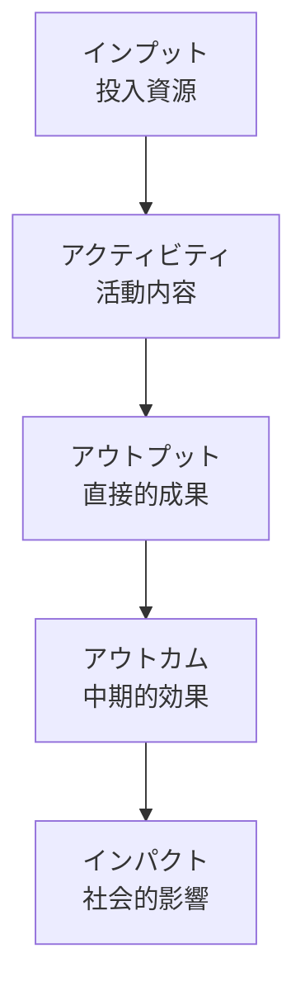
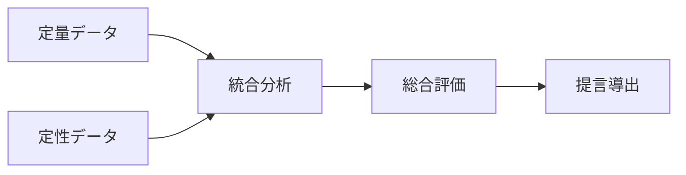
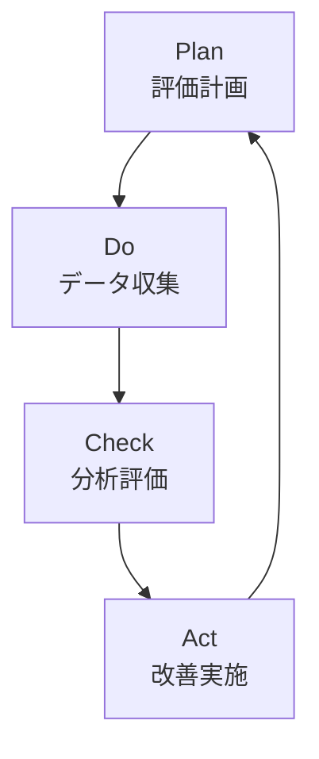

# インパクト評価フレームワーク 📊

このフレームワークは、NPOの活動が社会にもたらす変化（インパクト）を体系的に評価・測定するための指針です。

## 目次
- [評価の基本方針](#評価の基本方針)
- [評価指標の設定](#評価指標の設定)
- [データ収集方法](#データ収集方法)
- [分析手法](#分析手法)
- [報告と活用](#報告と活用)
- [改善サイクル](#改善サイクル)

## 評価の基本方針

### 1. 評価の目的



- **活動改善**
  - 効果的な施策の特定
  - リソース配分の最適化
  - プロセスの改善

- **説明責任**
  - 支援者への報告
  - 透明性の確保
  - 信頼関係の構築

### 2. 評価の原則

- **客観性**
  - 定量的指標の活用
  - 第三者評価の導入
  - エビデンスの重視

- **包括性**
  - 多面的な評価
  - 長期的影響の考慮
  - 副次的効果の把握

## 評価指標の設定

### 1. インパクト指標体系

```typescript
interface ImpactMetrics {
  outputMetrics: Metric[]; // 直接的な成果
  outcomeMetrics: Metric[]; // 中期的な効果
  impactMetrics: Metric[]; // 長期的な影響
}

interface Metric {
  name: string;
  definition: string;
  measurementMethod: string;
  frequency: string;
}
```

### 2. 評価階層



### 3. 指標例

#### プロジェクト評価
| 段階 | 指標例 | 測定方法 |
|-----|-------|---------|
|アウトプット|支援者数|直接カウント|
|アウトカム|生活改善度|アンケート調査|
|インパクト|地域活性化|複合的分析|

#### 組織評価
| 分野 | 指標例 | 測定周期 |
|-----|-------|---------|
|効率性|コスト効率|四半期|
|持続性|財務健全性|年次|
|影響力|認知度変化|半期|

## データ収集方法

### 1. データ収集計画

```python
class DataCollection:
    def plan_collection(self):
        """データ収集計画の策定"""
        pass
    
    def implement_collection(self):
        """データ収集の実施"""
        pass
    
    def validate_data(self):
        """データの検証"""
        pass
```

### 2. 収集ツール

- **定量データ**
  - アンケート調査
  - システムログ
  - 統計データ

- **定性データ**
  - インタビュー
  - 観察記録
  - ケーススタディ

### 3. データ品質管理

```typescript
interface DataQuality {
  validateAccuracy(): boolean;
  checkCompleteness(): boolean;
  ensureConsistency(): boolean;
  measureReliability(): number;
}
```

## 分析手法

### 1. 定量分析

```R
# 統計分析の例
analyze_impact <- function(data) {
  # 基本統計量の算出
  summary_stats <- summary(data)
  
  # 傾向分析
  trend <- analyze_trend(data)
  
  # 相関分析
  correlations <- cor(data)
  
  return(list(
    summary = summary_stats,
    trend = trend,
    correlations = correlations
  ))
}
```

### 2. 定性分析

- **コーディング**
  - キーワード抽出
  - パターン分析
  - テーマ化

- **ナラティブ分析**
  - ストーリーライン作成
  - 変化の過程分析
  - 文脈理解

### 3. 複合分析



## 報告と活用

### 1. レポーティング

```typescript
interface ImpactReport {
  summarizeFindings(): Summary;
  visualizeResults(): Visualization[];
  generateRecommendations(): Recommendation[];
}
```

### 2. 活用方法

- **内部活用**
  - 戦略立案
  - リソース配分
  - プロセス改善

- **外部共有**
  - 支援者報告
  - 広報活動
  - ナレッジ共有

### 3. 可視化

```python
class ImpactVisualization:
    def create_dashboard(self):
        """ダッシュボード作成"""
        pass
    
    def generate_charts(self):
        """チャート生成"""
        pass
```

## 改善サイクル

### 1. PDCAサイクル



### 2. 定期レビュー

- **四半期レビュー**
  - 進捗確認
  - 短期的調整
  - 課題対応

- **年次レビュー**
  - 総合評価
  - 戦略見直し
  - 長期計画更新

### 3. 継続的改善

```javascript
class ContinuousImprovement {
  identifyGaps() {
    // ギャップ分析
  }
  
  developActions() {
    // 改善策立案
  }
  
  implementChanges() {
    // 変更実施
  }
}
```

## 付録

### チェックリスト

#### 評価準備
- [ ] 評価目的の明確化
- [ ] 指標の設定
- [ ] データ収集計画
- [ ] 分析手法の選定

#### 実施プロセス
- [ ] データ収集の実行
- [ ] 品質チェック
- [ ] 分析実施
- [ ] 結果のレビュー

#### 活用フェーズ
- [ ] レポート作成
- [ ] 結果の共有
- [ ] 改善策の立案
- [ ] 実施計画への反映
