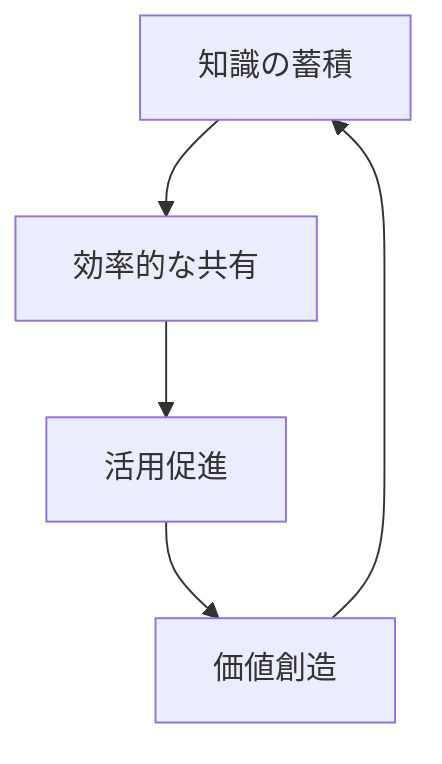
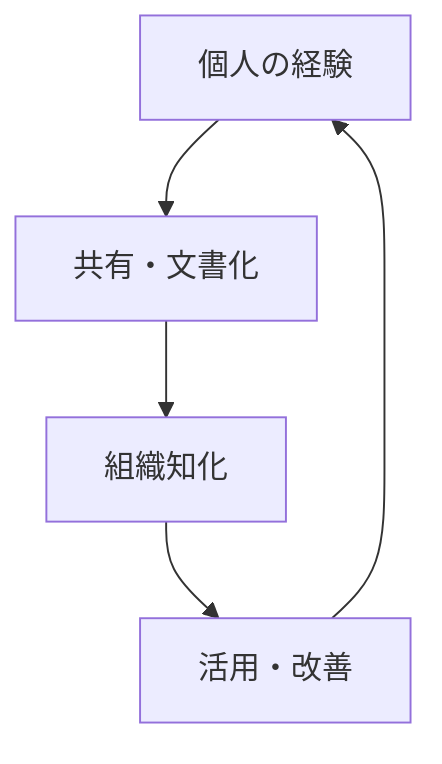
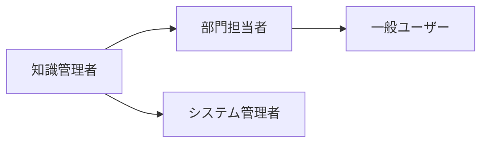
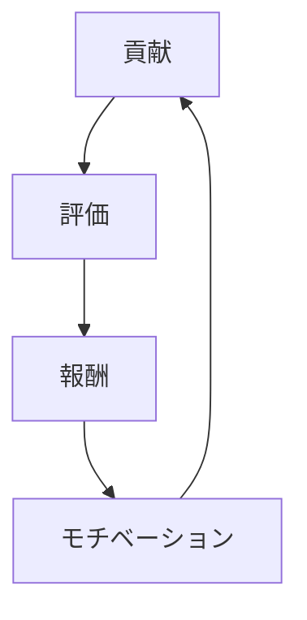
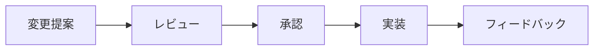

# 知識管理システム 📚

このドキュメントでは、NPOにおける知識・ノウハウの効果的な管理・共有の方法について説明します。

## 目次
- [基本方針](#基本方針)
- [知識の分類](#知識の分類)
- [管理システム](#管理システム)
- [共有方法](#共有方法)
- [活用促進](#活用促進)
- [メンテナンス](#メンテナンス)

## 基本方針

### 1. 知識管理の目的



- **組織力の向上**
  - 経験の蓄積
  - ノウハウの継承
  - 効率の改善

- **イノベーション促進**
  - 知識の組み合わせ
  - 新しい視点の創出
  - 問題解決力の向上

### 2. 基本原則

- **オープン性**
  - 情報アクセスの容易さ
  - 共有の促進
  - 透明性の確保

- **構造化**
  - 体系的な整理
  - 検索可能性
  - 関連付けの明確化

## 知識の分類

### 1. 形式知

```typescript
interface ExplicitKnowledge {
  documents: Document[];
  procedures: Procedure[];
  guidelines: Guideline[];
  metrics: Metric[];
}
```

- **ドキュメント**
  - マニュアル
  - 報告書
  - 議事録

- **データベース**
  - プロジェクト履歴
  - 成果指標
  - 連絡先情報

### 2. 暗黙知



- **個人の経験**
  - 問題解決手法
  - コミュニケーションスキル
  - 判断基準

- **組織文化**
  - 価値観
  - 行動規範
  - 慣習

## 管理システム

### 1. 技術インフラ

```javascript
class KnowledgeSystem {
  constructor() {
    this.repository = new Repository();
    this.searchEngine = new SearchEngine();
    this.accessControl = new AccessControl();
  }

  store(knowledge) {
    // 知識の保存
  }

  retrieve(query) {
    // 知識の検索
  }

  share(knowledge, recipients) {
    // 知識の共有
  }
}
```

### 2. 組織体制



### 3. プロセス管理

```python
class KnowledgeProcess:
    def collect(self):
        """知識の収集"""
        pass
    
    def organize(self):
        """知識の整理"""
        pass
    
    def distribute(self):
        """知識の配布"""
        pass
```

## 共有方法

### 1. デジタルプラットフォーム

- **ドキュメント管理**
  - GitHubリポジトリ
  - Wiki
  - クラウドストレージ

- **コミュニケーション**
  - チャット
  - フォーラム
  - メーリングリスト

### 2. 対面・リアルタイム

- **定期ミーティング**
  - 知識共有セッション
  - ケーススタディ
  - Q&Aセッション

- **ワークショップ**
  - ハンズオン
  - グループディスカッション
  - ロールプレイ

### 3. ハイブリッド形式

```typescript
interface KnowledgeSharing {
  digitalPlatform: Platform;
  realTimeEvents: Event[];
  documentation: Document[];
}
```

## 活用促進

### 1. インセンティブ設計



- **評価システム**
  - 貢献度の可視化
  - 品質評価
  - フィードバック

- **報奨制度**
  - バッジシステム
  - 表彰制度
  - 特典付与

### 2. 利用促進

```javascript
class UsagePromotion {
  trackUsage() {
    // 利用状況の追跡
  }

  promoteAdoption() {
    // 採用促進施策
  }

  measureEffectiveness() {
    // 効果測定
  }
}
```

## メンテナンス

### 1. 品質管理

- **レビュー体制**
  - 定期チェック
  - 精度確認
  - 更新確認

- **バージョン管理**
  - 履歴管理
  - 変更追跡
  - ロールバック

### 2. 更新プロセス



### 3. アーカイブ

```typescript
interface ArchiveSystem {
  archiveOldContent(): void;
  maintainHistory(): void;
  restoreFromBackup(): void;
}
```

## 付録

### チェックリスト

#### システム運用
- [ ] アクセス権設定
- [ ] バックアップ確認
- [ ] 検索機能確認
- [ ] セキュリティ確認

#### コンテンツ管理
- [ ] 最新性チェック
- [ ] 重複確認
- [ ] リンク確認
- [ ] フォーマット統一

#### ユーザー支援
- [ ] マニュアル整備
- [ ] トレーニング実施
- [ ] ヘルプデスク設置
- [ ] フィードバック収集
