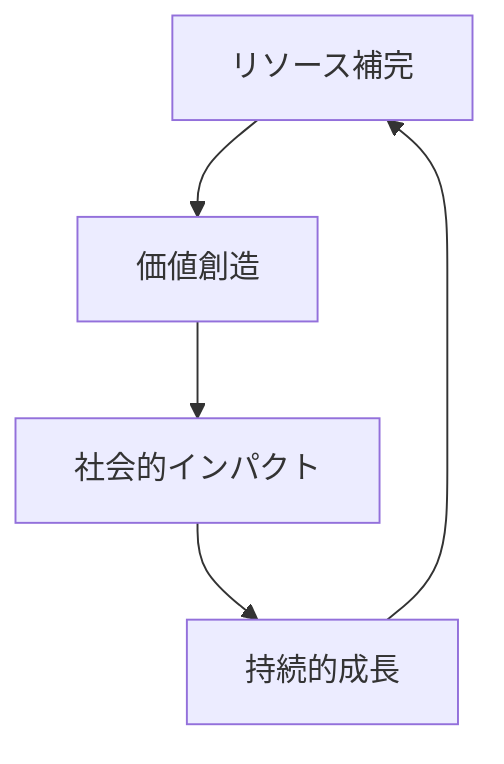
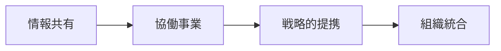
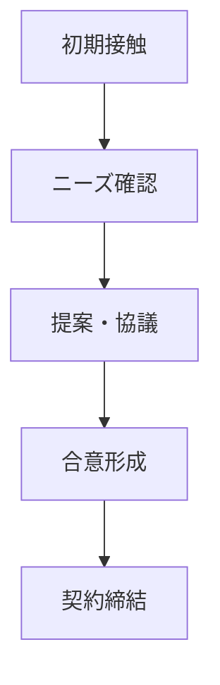
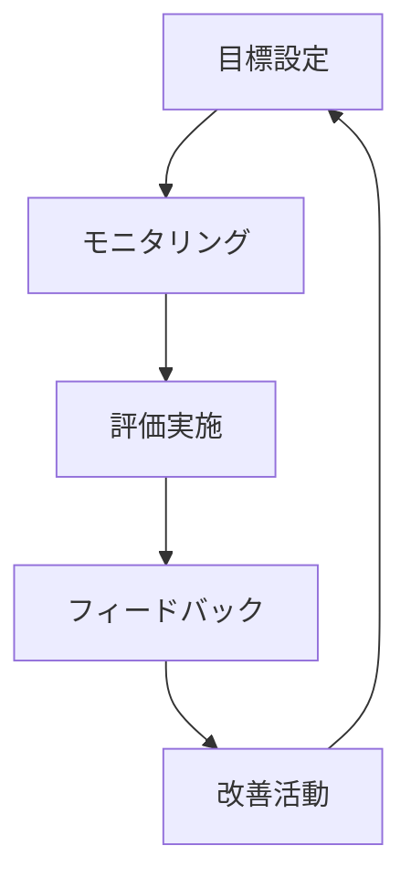
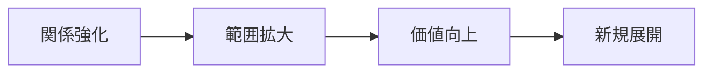

# パートナーシップフレームワーク 🤝

このドキュメントでは、NPOと外部組織との効果的な連携のためのフレームワークについて説明します。

## 目次
- [基本方針](#基本方針)
- [パートナー分類](#パートナー分類)
- [連携プロセス](#連携プロセス)
- [リスク管理](#リスク管理)
- [評価体制](#評価体制)
- [関係維持](#関係維持)

## 基本方針

### 1. パートナーシップの目的



- **相互価値の創造**
  - Win-Winの関係構築
  - 資源の有効活用
  - シナジー効果の創出

- **長期的視点**
  - 持続可能な関係
  - 段階的な発展
  - 信頼関係の構築

### 2. 連携の原則

```typescript
interface PartnershipPrinciples {
  transparency: boolean;
  fairness: boolean;
  mutualBenefit: boolean;
  sustainability: boolean;
}
```

## パートナー分類

### 1. 組織タイプ別

- **企業**
  - 大企業
  - 中小企業
  - スタートアップ

- **公共機関**
  - 政府機関
  - 地方自治体
  - 国際機関

- **教育機関**
  - 大学
  - 研究機関
  - 専門学校

### 2. 連携レベル別



### 3. 目的別分類

```javascript
class PartnershipType {
  constructor() {
    this.types = {
      resource: "リソース共有型",
      project: "プロジェクト型",
      advocacy: "アドボカシー型",
      research: "研究開発型"
    };
  }

  assessType(partner) {
    // パートナータイプの評価
  }
}
```

## 連携プロセス

### 1. パートナー選定

```python
class PartnerSelection:
    def evaluate_compatibility(self):
        """適合性評価"""
        pass
    
    def assess_capability(self):
        """能力評価"""
        pass
    
    def check_alignment(self):
        """方向性確認"""
        pass
```

### 2. 連携構築ステップ



### 3. 実施体制

- **推進体制**
  - 責任者の設定
  - チーム編成
  - 役割分担

- **コミュニケーション体制**
  - 定期会議
  - 報告ライン
  - 緊急連絡網

## リスク管理

### 1. リスク評価マトリックス

| リスク | 影響度 | 発生可能性 | 対策 |
|-------|--------|-----------|------|
|目的の不一致|高|中|事前確認|
|期待値ギャップ|中|高|定期的な擦り合わせ|
|リソース不足|高|中|計画的な配分|

### 2. リスク対応戦略

```typescript
interface RiskManagement {
  identifyRisks(): Risk[];
  assessImpact(risk: Risk): Impact;
  developMitigation(risk: Risk): Strategy;
  monitorRisks(): void;
}
```

## 評価体制

### 1. 評価指標

```javascript
class PartnershipMetrics {
  measureEffectiveness() {
    // 効果測定
  }

  evaluateProgress() {
    // 進捗評価
  }

  assessSatisfaction() {
    // 満足度評価
  }
}
```

### 2. 評価サイクル



### 3. フィードバックの活用

- **改善プロセス**
  - 課題の特定
  - 解決策の検討
  - 実施計画の調整

- **成功事例の共有**
  - ベストプラクティス
  - 学習ポイント
  - 展開可能性

## 関係維持

### 1. コミュニケーション戦略

```python
class CommunicationStrategy:
    def plan_regular_meetings(self):
        """定期会議の計画"""
        pass
    
    def create_reports(self):
        """報告書作成"""
        pass
    
    def manage_relationships(self):
        """関係性管理"""
        pass
```

### 2. 価値共創

- **共同プロジェクト**
  - 新規事業開発
  - 社会課題解決
  - イノベーション創出

- **知識共有**
  - ナレッジ交換
  - スキル移転
  - ベストプラクティス

### 3. 発展的な関係構築



## 付録

### チェックリスト

#### パートナー選定
- [ ] 適合性評価
- [ ] デューデリジェンス
- [ ] 方向性確認
- [ ] リソース確認

#### 連携開始
- [ ] 契約書確認
- [ ] 体制構築
- [ ] 計画策定
- [ ] キックオフ

#### モニタリング
- [ ] 進捗確認
- [ ] 課題管理
- [ ] 効果測定
- [ ] 関係維持
