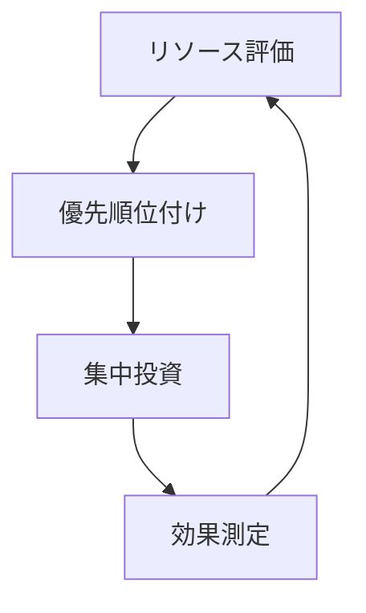
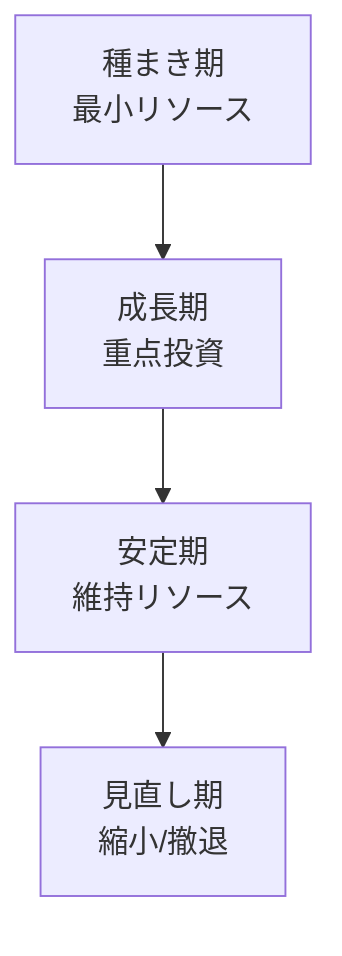
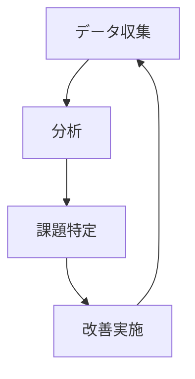

# リソース管理ガイド 📊

このガイドでは、限られたリソースを最大限に活用し、効果的なNPO運営を実現するための方法論を説明します。

## 目次
- [基本方針](#基本方針)
- [リソースの種類](#リソースの種類)
- [配分戦略](#配分戦略)
- [効率化施策](#効率化施策)
- [モニタリングと評価](#モニタリングと評価)
- [リスク管理](#リスク管理)

## 基本方針

### 1. 選択と集中 🎯



- **重点分野の選定**
  - 社会的インパクト
  - 実現可能性
  - 緊急性

- **段階的アプローチ**
  - 小規模スタート
  - 効果検証
  - 段階的拡大

### 2. 効率的な運用 ⚙️

- **自動化の活用**
  - 定型業務の自動化
  - データ処理の効率化
  - コミュニケーションの最適化

- **共有リソースの活用**
  - オープンソースツール
  - 共有インフラ
  - 知識ベース

## リソースの種類

### 1. 人的リソース 👥

```typescript
interface HumanResource {
  skills: string[];
  availability: number; // hours per week
  projects: Project[];
  utilization: number; // percentage
}

class ResourceAllocation {
  optimizeTeam(project: Project): Team {
    // チーム最適化ロジック
  }
}
```

### 2. 技術リソース 💻

- **開発環境**
  - クラウドサービス
  - 開発ツール
  - テスト環境

- **インフラ**
  - サーバー
  - ストレージ
  - ネットワーク

### 3. 財務リソース 💰

```python
class BudgetManagement:
    def allocate_budget(self, projects):
        """予算配分の最適化"""
        pass

    def track_expenses(self):
        """支出管理"""
        pass
```

## 配分戦略

### 1. プロジェクトステージ別配分



### 2. リソースマトリックス

|優先度|人的リソース|技術リソース|財務リソース|
|-----|----------|-----------|-----------|
|高|70-100%|フル支援|優先配分|
|中|30-70%|必要時支援|標準配分|
|低|0-30%|最小限|最小配分|

### 3. 柔軟な調整メカニズム

```javascript
class ResourceAdjustment {
  evaluatePerformance() {
    // パフォーマンス評価
  }

  reallocateResources() {
    // リソース再配分
  }
}
```

## 効率化施策

### 1. プロセス最適化


### 2. 技術活用

- **自動化ツール**
  - CI/CD
  - テスト自動化
  - レポート生成

- **コミュニケーションツール**
  - チャット
  - ビデオ会議
  - ドキュメント共有

### 3. 知識管理

```typescript
interface KnowledgeBase {
  documentBestPractices(): void;
  shareExperiences(): void;
  updateGuidelines(): void;
}
```

## モニタリングと評価

### 1. KPI設定

- **プロジェクト指標**
  - 進捗率
  - 品質指標
  - コスト効率

- **リソース指標**
  - 稼働率
  - 生産性
  - ROI

### 2. モニタリングシステム

```python
class PerformanceMonitoring:
    def collect_metrics(self):
        """メトリクス収集"""
        pass

    def analyze_trends(self):
        """傾向分析"""
        pass
```

### 3. 改善サイクル



## リスク管理

### 1. リスク評価マトリックス

|影響度|発生可能性|対応優先度|
|-----|---------|----------|
|高|高|即時対応|
|高|低|監視継続|
|低|高|予防措置|
|低|低|記録のみ|

### 2. リスク対応戦略

```typescript
interface RiskManagement {
  identifyRisks(): Risk[];
  assessImpact(risk: Risk): Impact;
  planMitigation(risk: Risk): Strategy;
  implementControls(): void;
}
```

### 3. コンティンジェンシープラン

- **バックアップ体制**
  - 人員の代替計画
  - システムの冗長化
  - データのバックアップ

- **緊急対応手順**
  - エスカレーションフロー
  - コミュニケーション計画
  - 復旧手順

## 付録

### チェックリスト

#### リソース評価
- [ ] 現状分析実施
- [ ] ボトルネック特定
- [ ] 改善策検討
- [ ] 実施計画策定

#### 効率化
- [ ] 自動化候補特定
- [ ] ツール選定
- [ ] プロセス改善
- [ ] 効果測定

#### リスク管理
- [ ] リスク評価
- [ ] 対策立案
- [ ] 監視体制確立
- [ ] 定期レビュー
