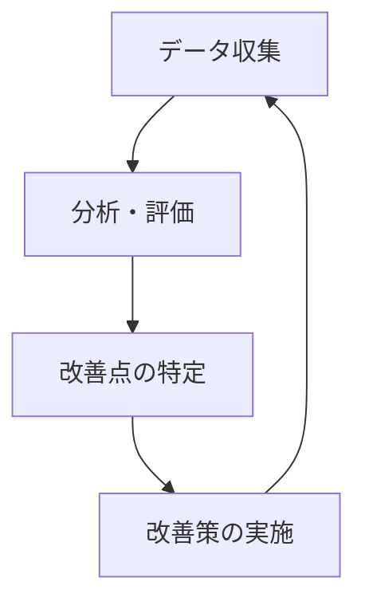

// ...existing code...
## おわりに 🌈

このアプローチにより、私たちは限られたリソースで最大限の社会的インパックトを目指しています。
まるで種を撒き、水をやり、成長を見守る庭師のように、
各プロジェクトの可能性を大切に育てながら、持続可能な形で社会に貢献していきます。

## 発展的なNPO運営モデル 🚀

### コミュニティ参加の促進 👨‍👩‍👧‍👦

オープンソースの精神を取り入れたプロジェクト運営で、より多くの人々の参加を促進します：

- **外部貢献の仕組み**
  - 明確なコントリビューションガイドライン
  - 初心者向けの「Good First Issue」の設定
  - 定期的な公開ミーティングの実施

- **コミュニティ認知と報酬**
  - 積極的な貢献者の表彰と紹介
  - コミュニティメンバーの成長機会の提供
  - 参加者同士の交流の場の創出

### インパクト測定と評価 📊

データに基づく意思決定とインパクト向上のための評価システム：

- **測定の仕組み**
  - プロジェクト別の具体的な成果指標の設定
  - 受益者へのインタビューや事例収集
  - リアルタイムでインパクトを可視化するダッシュボード

- **定期的な振り返り**
  - 四半期ごとのインパクトレポートの公開
  - 評価結果に基づく継続的な改善プロセス
  - 失敗から学ぶ文化の醸成

### AI活用の具体的方法論 🤖

各プロジェクトステージに応じたAI活用のガイドライン：

- **プロジェクト規模別AI活用**
  - 🌱 **種まき期**: 市場調査、アイデア生成、初期プロトタイプ作成
  - 🌿 **待機中**: 自動返信システム、データ収集・分析、最小限の運用自動化
  - 🌳 **成長期**: 意思決定支援、高度な分析、パーソナライゼーション

- **人間とAIの役割分担**
  - 創造性と戦略的判断は人間が担当
  - 定型業務と大量データ処理はAIに委託
  - ハイブリッドアプローチによる最適化

- **AIツールセット一覧**

| 用途 | 推奨ツール | 使用例 |
|------|------------|--------|
| コンテンツ作成 | ChatGPT, Jasper | ニュースレター、報告書の下書き |
| データ分析 | AutoML, Tableau | インパクト指標の可視化 |
| 業務自動化 | Make, Zapier | 申請フォーム処理、通知 |
| 翻訳・多言語対応 | DeepL API | 多言語コミュニティ対応 |

### 知識管理と組織学習 📚

プロジェクト間での知識共有と組織的な学習を促進：

- **ナレッジベースの構築**
  - 共有ウィキやドキュメント管理システム
  - プロジェクト横断的な知見の体系化
  - ベストプラクティスと教訓のライブラリ

- **学習の仕組み**
  - 定期的なレトロスペクティブミーティング
  - クロスプロジェクト学習セッション
  - メンターシッププログラムの運営

### 資金調達の多様化戦略 💰

持続可能な運営のための多角的な資金調達アプローチ：

- **多様な資金源**
  - 月額サポーター制度
  - プロジェクト別クラウドファンディング
  - 戦略的な助成金申請
  - 一部サービスの収益化モデル

- **資金の効率的活用**
  - 成功プロジェクトからの内部再投資
  - リソースシェアリングによるコスト削減
  - 長期・短期のバランスの取れた資金計画

### パートナーシップ構築 🤝

戦略的連携による影響力拡大：

- **連携の枠組み**
  - 他団体との協働のためのガイドライン
  - 専門家ネットワークの構築
  - セクター横断的な連携モデル

- **Win-Winの関係構築**
  - 相互価値の創出
  - 長期的な信頼関係の醸成
  - リソースと専門性の相互補完

## 実施ロードマップ 🗺️

このガイドに基づく実施手順：

1. **準備フェーズ**
   - GitHub Projectsの設定と運用ルールの策定
   - 評価指標とダッシュボードの設計
   - AIツールの選定とトレーニング

2. **導入フェーズ**
   - プロジェクト評価とリソース配分の最適化
   - コミュニティ参加モデルの実装
   - 知識管理システムの構築

3. **発展フェーズ**
   - パートナーシップの拡大
   - 資金調達戦略の多様化
   - インパクト評価に基づく継続的改善

## 結論：持続可能なインパクトの創出 🌏

このモデルを通じて、私たちは限られたリソースを最大限に活用しながら、長期的な社会課題の解決に取り組みます。透明性の高い運営と積極的なコミュニティ参加により、支援の輪を広げ、より大きなインパクトを生み出すことを目指します。

小さく始めて大きく育てる。それが私たちのNPO運営の哲学であり、このガイドはその実践のための道しるべとなります。