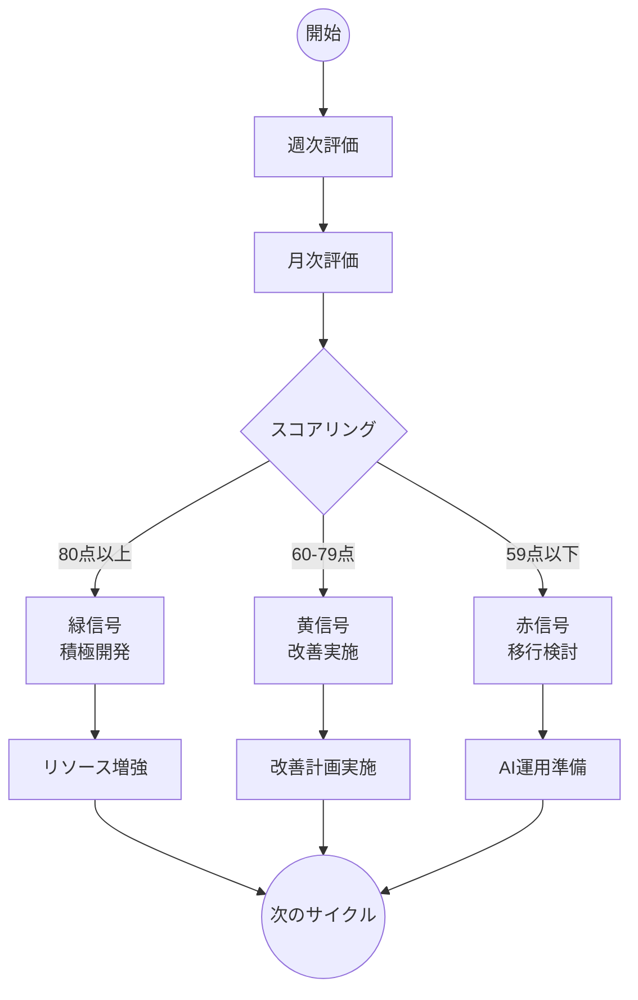
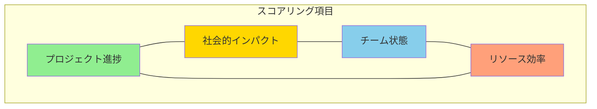
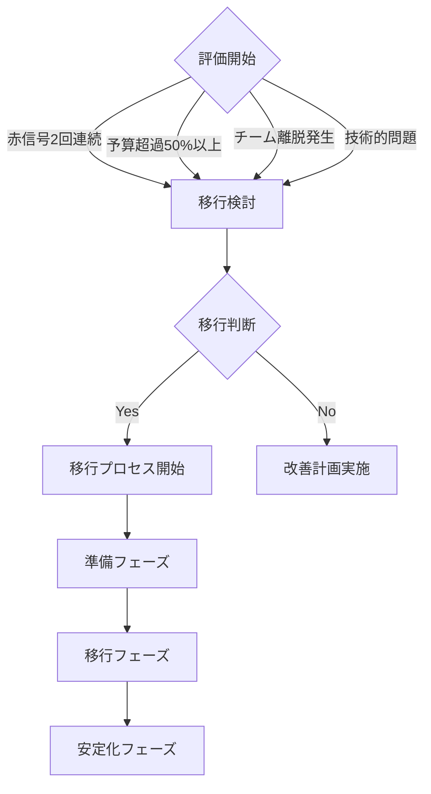
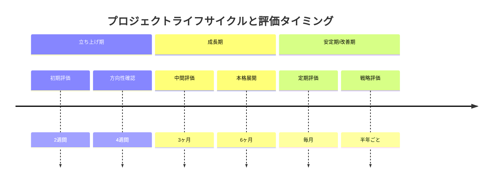

# プロジェクト評価・運用ガイドライン

## 📊 評価システム概要

プロジェクトの健全性を「信号機方式」で評価し、リソース配分と運用方針を決定します。

### 評価サイクル

| フェーズ | タイミング | 主な評価項目 |
|---------|------------|-------------|
| 立ち上げ | 2-4週間後 | 初期進捗、技術的実現性 |
| 成長期 | 3-6ヶ月 | KPI達成度、リソース効率 |
| 安定期 | 毎月 | 持続可能性、社会的インパクト |

### プロジェクト評価フロー



## 🎯 スコアリング基準

### 評価項目の関係性



### 基本評価項目（各項目0-5点）

1. **プロジェクト進捗**
   - [ ] スプリント目標の達成率
   - [ ] 技術的負債の状況
   - [ ] 予算消化の健全性
   - [ ] チームの生産性
   - [ ] 品質指標の達成度

2. **社会的インパクト**
   - [ ] 受益者数の推移
   - [ ] 問題解決の効果
   - [ ] コミュニティからのフィードバック
   - [ ] メディア/外部評価
   - [ ] 長期的な持続可能性

3. **チーム状態**
   - [ ] メンバーのモチベーション
   - [ ] 技術的成長
   - [ ] コミュニケーション品質
   - [ ] 作業効率
   - [ ] チーム満足度

4. **リソース効率**
   - [ ] 予算執行状況
   - [ ] 人的リソースの最適配分
   - [ ] ツール/技術の活用度
   - [ ] 外部リソースの活用
   - [ ] コスト対効果

## 🚦 判定基準とアクション

### 緑信号（80点以上）
- **状態**: 順調
- **特徴**:
  - KPI達成率90%以上
  - 予算執行計画通り
  - チーム満足度高
  - 社会的インパクト明確
- **アクション**:
  - 積極的な開発継続
  - 機能拡張の検討
  - リソース増強の検討

### 黄信号（60-79点）
- **状態**: 要注意
- **特徴**:
  - KPI達成率70-89%
  - 予算超過の兆候
  - チーム課題の発生
  - 期待値とのギャップ
- **アクション**:
  - 課題の明確化
  - 改善計画の立案・実施
  - リソース配分の最適化

### 赤信号（59点以下）
- **状態**: 危険
- **特徴**:
  - KPI達成率70%未満
  - 深刻な予算超過
  - チーム機能の低下
  - 社会的インパクト不明確
- **アクション**:
  - 最小限運用への移行検討
  - AIによる自動化検討
  - チーム再配置の準備

## 🔄 最小限運用への移行基準

### 即時移行条件（以下のいずれかに該当）
- 赤信号が2回連続
- 予算超過50%以上
- チームメンバーの離脱
- 重大な技術的問題の発生

### 移行プロセス

### 移行判断フロー



1. **準備フェーズ（2週間）**
   - 自動化可能な業務の洗い出し
   - 必要なAIツールの選定
   - データ移行計画の策定
   - チーム再配置の計画立案

2. **移行フェーズ（4週間）**
   - 段階的な自動化の実装
   - モニタリングシステムの構築
   - ドキュメントの整備
   - チームの段階的な移行

3. **安定化フェーズ（4週間）**
   - 自動化システムの検証
   - 運用フローの最適化
   - 問題点の修正
   - 最終的な運用体制の確立

## 📊 評価ツール

### 週次チェックリスト
- [ ] GitHub Issuesの進捗確認
- [ ] チームミーティングの実施状況
- [ ] バグ報告数の推移
- [ ] ユーザーフィードバックの確認

### 月次チェックリスト
- [ ] KPI達成状況の評価
- [ ] 予算消化状況の確認
- [ ] チーム満足度調査の実施
- [ ] 社会的インパクトの測定
- [ ] リソース配分の見直し

## 📝 評価レポートテンプレート

```markdown
### プロジェクト月次評価レポート

プロジェクト名：
評価期間：YYYY/MM/DD - YYYY/MM/DD
評価者：

#### スコア
- プロジェクト進捗：__/25
- 社会的インパクト：__/25
- チーム状態：__/25
- リソース効率：__/25
総合スコア：__/100

#### 信号判定
判定：[緑|黄|赤]
判定理由：

#### 主要な成果
1. 
2. 
3. 

#### 課題点
1. 
2. 
3. 

#### 推奨アクション
1. 
2. 
3. 

#### 次月度目標
1. 
2. 
3. 
```

## 🔍 評価の実施方法

### プロジェクトライフサイクル



1. **データ収集**
   - GitHub/JIRAの進捗データ
   - 予算執行状況
   - チームフィードバック
   - ユーザーメトリクス

2. **スコアリング**
   - 各項目を0-5点で評価
   - 評価根拠の記録
   - 前月比の算出

3. **判定とアクション**
   - 信号判定の実施
   - 具体的なアクションの決定
   - チームへのフィードバック

4. **報告とレビュー**
   - 評価レポートの作成
   - ステークホルダーへの共有
   - 改善点の議論

この評価システムを効果的に活用することで、プロジェクトの健全性を維持し、適切なタイミングでの方向性転換を実現します。
